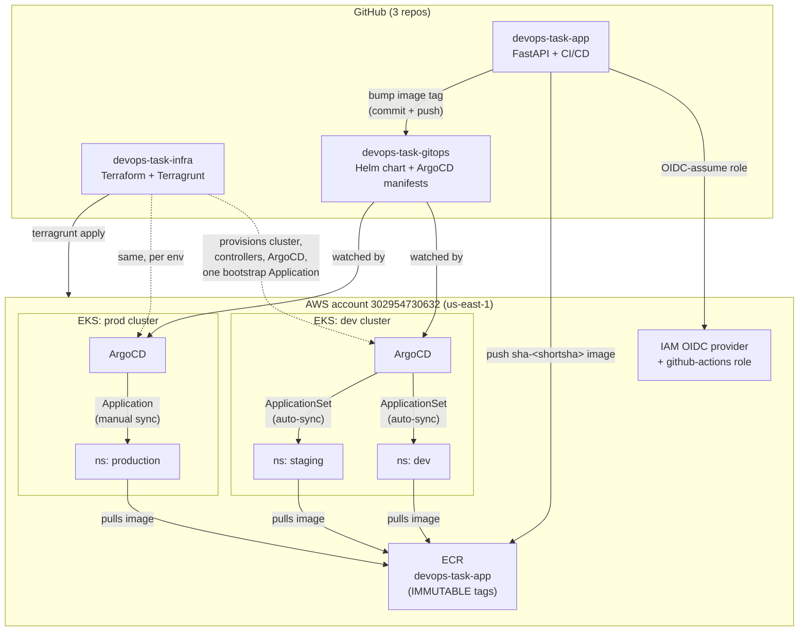

# Architecture

**Promotion flow**: a push to `app`'s `dev` branch builds once, smoke-tests the container, pushes
one immutable tag to ECR, then bumps that tag into `gitops/apps/dev/values-dev.yaml` - ArgoCD's
ApplicationSet on the dev cluster picks it up automatically. Merging `dev` → `staging` (a PR within
`app`) re-tags the *same* image into `apps/dev/values-staging.yaml`, no rebuild. Merging
`staging` → `prod` does the same into `apps/prod/values-production.yaml`, but production's
`Application` has no automated sync policy - the tag lands in git immediately, but a human still
clicks Sync in ArgoCD before it actually deploys.
